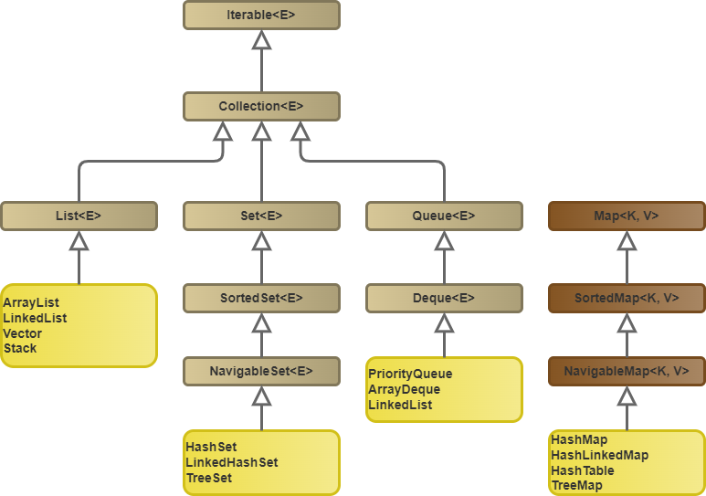

# Java Collection Dominando Listas, Sets e Mapas <!-- omit in toc -->



## Links Importantes <!-- omit in toc -->

* [JAVADOC - Collections](https://docs.oracle.com/javase/8/docs/api/java/util/Collections.html)

## Menu <!-- omit in toc -->

* [Aulas](#aulas)
  * [Trabalhando Com ArrayList](#trabalhando-com-arraylist)
  * [Listas De Objetos](#listas-de-objetos)
  * [Relacionamento Com Coleções](#relacionamento-com-coleções)
  * [Mais Práticas Com Relacionamentos](#mais-práticas-com-relacionamentos)
  * [O Poder Dos Sets](#o-poder-dos-sets)
  * [Aplicando O Set No Modelo](#aplicando-o-set-no-modelo)
  * [Equal e HashCode](#equal-e-hashcode)
  * [Outros Sets E Iterators](#outros-sets-e-iterators)
  * [Mapas](#mapas)
* [Últimas Palavras](#últimas-palavras)
* [Um Estudo Em Métodos](#um-estudo-em-métodos)
  * [Colletions UnmodifiableSet](#colletions-unmodifiableset)
  * [Collections EmptySet](#collections-emptyset)

## Aulas

### Trabalhando Com ArrayList

---

Os *ArrayLists* devem ser um dos *Objetos* que eu mais uso. Sempre preciso guardar uma "coleção de coisas". Depois que nos acostumamos eles são até que fáceis de usar. Quando eu comecei a programar foi um parto intender como eles funcionavam.

A declaração deles é relativamente simples, só temos que prestar atenção em um ponto: o *Arraylist* é um tipo de objeto genérico, e pode parecer um pouco estranho para quem não está acostumado, tipo eu; nesse caso eu só aceito.

Nesse exemplo temos uma *Array* de *String*

```java
ArrayList<String> aulas = new ArrayList<>();
```

E como toda boa classe, existe uma lista de métodos que podemos usar. Claro que não usamos todos, existem aqueles que sempre precisamos, e aqueles que procuramos na [documentação](https://docs.oracle.com/javase/8/docs/api/java/util/List.html).

O que mais iremos utilizar é o `add()`. Nem preciso explicar, certo?

```java
String aula1 = "Conhecendo mais de listas";
String aula2 = "Modelando a classe Aula";
String aula3 = "Trabalhando com Cursos e Sets";

aulas.add(aula1);
aulas.add(aula2);
aulas.add(aula3);
aulas.add("Aula primeira");
```

Assim como conseguimos colocar, também conseguimos tirar, só que com o `remove()`, esse aqui eu quase nunca uso, concordo que pode ser útil. Veja que nesse exemplo estou removendo por índice, existem outras formas para utilizar esse método.

```java
aulas.remove(0);
```

Quanto queremos recuperar um *Objeto* de dentro do *ArrayList* utilizamos, um método muito sugestivo na comunidade **DEV**, o `get()`.

```java
String primeiraAula = aulas.get(0);
```

Olha, saber o básico de Inglês ajuda muito, até agora o que os métodos fazem foi uma tradução direta do nome método, e ainda tem mais. Se quisermos verificar a quantidade de elementos em um *ArrayList* usamos `size()`.

```java
aulas.size()
```

Existem uma ou outra forma para ordenar um *ArrayList*. Caso queira algo rápido e sem burocracia pode utilizar o método `sort()` da classe *Colletions*. Nesse exemplo os elementos serão ordenados de forma alfabética.

```java
Collections.sort(aulas);
```

Por fim, e não menos importante, existem algumas formas de se percorre um *ArrayList*, boas e ruim, e elegantes. A primeira que aprendemos, e talvez a ruim, é o **loop for**.

```java
for(int i = 0; i < aulas.size(); i++){
    System.out.println("Aulas: " + aulas.get(i));
}
```

Depois que aprendemos mais um pouquinho sobre a linguagem, conhecemos as *lambda functions*, e já começamos a deixar um pouco mais elegante o código.

```java
for (String aula : aulas) {
    System.out.println("Nome Aula: " + aula);
}
```

E por fim a forma que eu acho mais elegante, usar o método `forEach()`. Além de ser o mais elegante, ele garante o paralelismo.

```java
aulas.forEach(aula -> {
    System.out.println("ForEach aula: " + aulas);
});
```

### Listas De Objetos

---

Essas listas são bem poderosas, elas conseguem guardar quase que qualquer coisa dentro delas, literalmente. Agora vamos ao que mais iremos guardar, provavelmente, *Objetos* gerados a partir de nossas classes.

E veja, dizem que Java é complicado, mas não existe diferença entre adicionar *String* ou uma *Classe* na lista, bem tem, só o tipo de *Objeto* que estará dentro dela.

```java
Aula a1 = new Aula("Revisando as ArrayList", 21);
Aula a2 = new Aula("Listas de Objetos", 20);
Aula a3 = new Aula("Relacionamento de listas e objetos", 15);

ArrayList<Aula> aulas = new ArrayList<>();
aulas.add(a1);
aulas.add(a2);
aulas.add(a3);
```

Um tanto quanto simples. O que não é tão simples é a ordenação desses caras uma vez que, o método `sort()` de *Collections* não sabe o critério para ordenação das *Aulas*.

Java possui a interface *Comparable*, com ela conseguimos definir como um objeto deve ser comparado; por ser uma interface genérica precisaremos indicar com qual tipo de objeto ela irá trabalhar.

```java
public class Aula implements Comparable<Aula>
```

Essa interface nos obriga a implementar o método `compareTo()` que deve retornar um número negativo, zero ou um número positivo, esse resultado será utilizado para decidir se um elemento vem antes do outro. Nesse exemplo iremos classificar as aulas por *título*, para tal aproveitaremos o método de comparação da *String*.

```java
@Override
public int compareTo(Aula outraAula) {
    return this.titulo.compareTo(outraAula.titulo);
}
```

Agora nosso `sort()` de *Collections* realizará uma comparação por nomes.

```java
Collections.sort(aulas);
```

A classe só pode implementar um método `compareTo()`, caso desejemos comparar de outra forma, teremos que utilizar de outra tecnica, já que não quereremos quebrar códigos gerados antes de nosso novo desejo. Vamos esquecer um pouco *Collections*, e olhar para o método `sort()` de *ArrayList*.

Agora as coisas ficam um pouco mais abstratas, ao menos para mim é um pouco complicado conseguir ler e intender o que está acontecendo no código, claro que tudo é prática. Parando de enrolação: esse método precisa receber *Comparator*, mais especificamente, que seja implementado o método `comparing()`. Nosso desafio será ordenar nosso *ArrayList* pelo tempo de cada aula.

Veja como pode ficar elegante o código:

```java
aulas.sort(Comparator.comparing(Aula::getTempo));
```

O que está acontecendo aqui, até onde eu consigo intender é: estamos utilizando o método `sort()` do objeto **aulas**, passando como parâmetro uma instância do objeto *Comparator*, implementando o método `comparing()`, dizendo para ele comparar os objetos de **aulas** utilizando o método `getTempo()`, que retorna o tempo de cada aula.

### Relacionamento Com Coleções

---

Podemos utilizar o poder do polimorfismo em nossas listas. Quando nosso objeto possui um atributo que será uma coleção de outros objetos, podemos declará-lo como uma *List*, genérico dessa forma. Quando usarmos esse atributo não precisaremos nos preocupar com o que ele está enviando a nos.

```java
public class Curso {
    private String nome;
    private String instrutor;
    private List<Aula> aulas = new ArrayList<Aula>();
```

Veja; para que utiliza a lista de aulas, pouco importa o tipo de lista. Além disso, é possível retornar uma lista que não pode ser modificada.

```java
public List<Aula> getAulas() {
    return Collections.unmodifiableList(aulas);
}
```

Isso garante que somente a classe *Curso* terá permissão de manipular essa lista.

Por fim, esse polimorfismo nós garante a possibilidade de trabalhar com *ArrayList* ou *LinkedList*, a depender do nosso problema.

Quando trabalharmos com uma lista que precisa sofre muitas alterações, inserção e remoção, é interessante utilizar uma *LinkedList*; para consultar um índice especifico em um lista é recomendado a utilização de um *ArrayList*.

### Mais Práticas Com Relacionamentos

---

Vamos continuar de onde paramos em um passado não muito distante, retorno de listas não modificáveis. É uma boa prática não deixar que aplicações externas alterarem nossos atributos. Se uma aplicação quiser fazer alguma coisa com a lista deverá criar uma cópia dela.

```java
List<Aula> aulasImutaveis = javaColecoes.getAulas();
List<Aula> aulas = new ArrayList<>(aulasImutaveis);
```

Podemos usar os métodos que já conhecemos nesse novo objeto.

```java
aulas.sort(Comparator.comparing(Aula::getTitulo));
```

Só para título de curiosidade, não entendo nada disso ainda, essa é uma forma de retornar a soma dos tempos das aulas que estão na lista.

```java
this.aulas.stream().mapToInt(Aula::getTempo).sum();
```

### O Poder Dos Sets

---

Nem só de *List* vive um *dev*, apresento-vos os **Sets**. Eles são algo similar à *List*, já que implementam a mesma interface, *Colletion*, alguns métodos são simulares, outros nem tantos, outros nem existem. Enfim, serve para algo.

Por hora vamos brincar com os `HashSet<>()`.

```java
Set<String> alunos = new HashSet<>();
```

Obvio que ela trabalha de forma genérica também, ei de entender isso à fundo. Nada muda na forma de adicionar itens.

```java
alunos.add("Rodrigo Gonçalves");
alunos.add("Matheus Braga");
alunos.add("João Neto");
alunos.add("Maria Mar");
alunos.add("Pedro Lens");
alunos.add("José Json");
```

E aqui iremos comentar uma das diferenças desse com aqueles, os *Sets* não garantem a ordem de inserção, eles não guardam um índice para acesso aos elementos, isso implica em não termos métodos que consulte um elemento a partir de um índice, ou qualquer outro método que utilize o índice.

Porém, tem algo em que eles são bons: consultar se um elemento está ou não presente.

```java
boolean achei = alunos.contains("Kamyla");
```

Um outro ponto bem legal é: os *Sets* não gravam informações repetidas, muito legal isso.

### Aplicando O Set No Modelo

---

Continuando na mesma pegada, depois de *String*, *Classes*. Criaremos a classe `Aluno` sem nada demais. E em nossa classe *Curso* criaremos o atributo **alunos** do tipo *Set*, que trabalhará com um `HashSet<>()`.

```java
private Set<Aluno> alunos = new HashSet<>();
```

Assim como vimos em *Lists*, aqui não existirá grandes diferenças entre se trabalhar com uma *String* ou um objeto de outro classe.

```java
Aluno a1 = new Aluno("Rodrigo Gonçalves", 1);
Aluno a2 = new Aluno("Alan Alado", 2);
Aluno a3 = new Aluno("José Ze", 3);

javaColecoes.matricular(a1);
javaColecoes.matricular(a2);
javaColecoes.matricular(a3);
```

### Equal e HashCode

Agora as coisas estão começando a complicar, nosso amigo **HashSet** trabalha com um tal de *tabela de espalhamento*, o que sei sobre isso até o momento? *Sei que nada sei*. Estudarei em outro momento. Enfim, é importante intender um pouco sobre esse assunto para saber o que acontece por trás da comparação entre objetos.

Para comparar objetos devemos criar o método `equals()` em nossa classe, ele dirá à JVM qual o critério de comparação.

```java
@Override
public boolean equals(Object obj) {
    Aluno aluno = (Aluno) obj;
    return this.nome.equals(aluno.getNome() );
}
```

E como estamos usando um **HashSet**, e também como uma boa prática, devemos criar o método `hashCode()`, ele meio que identifica o nosso objeto com um "número mágico", isso garante que a consulta será rápida.

```java
@Override
public int hashCode() {
    return this.nome.hashCode();
}
```

Os métodos apresentados até aqui foram criados na classe *Aluno*. Para completar o álbum, vamos ensinar a classe *Cursos* verificar se ela contém um aluno.

```java
public boolean estaMatriculado(Aluno aluno) {
    return this.alunos.contains(aluno);
}
```

Por obvio iremos delegar, essa é uma boa prática. Olha que lindo, nossa classe *Aluno* sabe como comprar alunos e a *Curso* sabe verificar se o aluno está matriculado

```java
Aluno nomeBusca = new Aluno("Rodrigo Gonçalves", 1);
System.out.println("Procura com equals(): " + a1.equals(nomeBusca));
System.out.println("Procura com contains(): " + javaColecoes.estaMatriculado(nomeBusca));
```

A implementação dos métodos `equals()` e `hashCode()` pode não ser tão simples assim, por isso é recomendado seguir a [documentação](
https://docs.oracle.com/javase/8/docs/api/java/lang/Object.html#equals-java.lang.Object-)

### Outros Sets E Iterators

Como podemos observar existem uma gama relativamente grande de *Lists* e *Sets*. Para finalizar a parte referente aos *Sets*, comentarei brevemente mais dois.

O **LinkedHashSet** garante a ordem de adição, porém ainda não temos como consultar por índice. O **TreeSet**, precisa que a classe *Comparable* seja implementada na classe; usa uma estrutura de dados diferente; mais rápido que set; ela guarda os elementos na ordem do comparable.

Passando meio por cima desses dois pois são pouco utilizados, ao menos por mim. Em um futuro não muito distante, quero estudar todas as estruturas de dados comentados nesse breve estudo sobre coleções.

### Mapas

Não é uma coleção, mas "bem que poderia ser". Eu gosto muito de trabalhar com **Map**, ele funciona com chave-valor o que, em alguns casos, facilita muito. Por obvio a chave deve ser única.

**Map** é uma interface, existem algumas classes que a implementam, vamos usar uma implementação "meio que conhecida".

```java
private Map<Integer, Aluno> matriculaParaAluno = new HashMap<>();
```

Meio porque, assim como *Set* possui o **HashSet**, *Map* possui o **HashMap**, semelhante, mas não igual. Para guardar itens dentro desse objeto:

```java
this.matriculaParaAluno.put(aluno.getMatricula(), aluno);
```

Ao invés de `add()`, `put()`, semelhante, mas não igual.

## Últimas Palavras

Coleções, incluo aqui os *Maps*, são muito úteis e utilizadas em nosso dia a dia. Sei que falta entender um pouco mais a fundo como elas funcionam por baixo dos panos, porém, creio eu, para o que aprendi aqui me ajuda a resolver os problemas do meu dia a dia.

Em um primeiro momento colocamos os pés na água para sentir a temperatura, conforme vamos ganhando confiança pensamos em mergulhar, até que não queremos mais sair da água.

Aqui estou colocando meus pés nas águas das coleções.

## Um Estudo Em Métodos

Durante o curso foram apresentados alguns métodos que valem à pena se aprofundar um pouco.

### Colletions UnmodifiableSet

A classe *Collecions* possui uns tantos quantos de métodos interessantes, `unmodifiableSet(Set<? extends T> s)` é um deles.

Quando desejarmos que uma aplicação não tenha permissão para alterar um conjunto de dados usamos esse método, ele auxiliará a classe a fornecer um conjunto de dados com acesso "somente leitura". Qualquer operação não permitida realizado no objeto retornado resultará na exceção `UnsupportedOperationException`. O objeto retornado ainda pode ser serializado.

### Collections EmptySet

`emptySet()` retorna um conjunto vazio e imutável, ainda serializável. Esse método garante o tipo no campo. Por exemplo, podemos utilizar esse método quando nosso *Curso* não tenha alunos cadastrados nele.

```java
Set<> s = Collections.emptySet();
```
