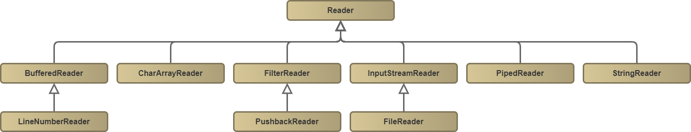

# Java e java.io: Streams, Reader e Writers <!-- omit in toc -->

Coisas que sempre teremos que fazer em nossa vida de programadores: *Trabalhar com arqauivos*; ninguém escapa disso. E não é de todo ruim, a quantidade de trabalho que dá para economizar em empresas só de criar um projeto que move, renomeia e junta arquivos não está no gibi.

>Gosto muito dessa parte de manipulação de arquivos.

Claro que nesse curso não ficarei somente com isso. **Streams** são coisas realmente poderosas em Java.

## Links Importantes <!-- omit in toc -->

[THIENGO - PADRÃO DE PROJETO DECORATOR](https://www.thiengo.com.br/padrao-de-projeto-decorator-decorador)
[REFACTORING GURU - DECORATOR](https://refactoring.guru/pt-br/design-patterns/decorator)

## Menu De Aulas <!-- omit in toc -->

* [InputStream](#inputstream)
* [Reader](#reader)
* [OutputStream](#outputstream)
* [Writer](#writer)
* [Aulas](#aulas)
  * [Estabelecendo a entrada](#estabelecendo-a-entrada)
  * [InputStream e Reader](#inputstream-e-reader)
  * [OutputStream E Writer](#outputstream-e-writer)
  * [Outras Entradas E Saídas](#outras-entradas-e-saídas)
  * [Saída Com FileWriter](#saída-com-filewriter)
  * [PrintWriter E PrinStream](#printwriter-e-prinstream)
  * [Leitura Com Scanner](#leitura-com-scanner)
  * [Parseando Arquivo](#parseando-arquivo)
  * [Formatação De Valores](#formatação-de-valores)
  * [Character Sets](#character-sets)
  * [Encoding No Windows](#encoding-no-windows)
  * [Encoding Com java.io](#encoding-com-javaio)
  * [Serialização Java](#serialização-java)
  * [Serializando Qualquer Objeto](#serializando-qualquer-objeto)
  * [Serializando Com Herança](#serializando-com-herança)

## InputStream

Essa classe nos possibilida trabalhar com a entrada de um fluxo de dados. Ela está no topo da cadeia alimentar, ou quase, por isso é a mais genérica possível.

Ela pois várias filhas e netas, na imagem abaixo eu mostro somente aquelas que estão no pacote java.io, por ser meu objeto de estudo. É sempre bom ter a [documentação](https://docs.oracle.com/javase/7/docs/api/java/io/InputStream.html) em mãos.


## Reader

Os **Readers** são responsáveis por darem uma tratada no retorno dos **InputStream**, eles facilitam nosso trabalho, veremos isso mais adiante.

Nessa imagem eu coloco a árvore que montei a partir da [documentação](https://docs.oracle.com/javase/7/docs/api/java/io/StringReader.html).



## OutputStream

Agora começamos a entrar na saída de dados, meio que seguiremos o mesmo padrão anterior: uma classe mais genérica que será decoradas com outras para facilitar nossa vida.
Como nas demais, tirei essas informações da [documentação](https://docs.oracle.com/javase/7/docs/api/java/rmi/server/LogStream.html).


## Writer

Continunado, temos os **Writer** que, assim como os **Readers**, irão decorar os **OutputStream** trazendo novas funcionalidades e facilidades. Para mais datalhes podemos sempre recorrer à [documentação](https://docs.oracle.com/javase/7/docs/api/java/io/Writer.html)


## Aulas

### Estabelecendo a entrada

---

Os dados podem vir de vários lugares e fontes, por exemplo arquivo, rede e teclado, a isso damos o nome de fluxo de entrada; a aplicação trabalhará com essa informações e devolverá um fluxo de saída, que também pode ser em vários formatos.

Começaremos nosso tabalho com um fluxo de entrada vindo de um arquivo, **lorem.txt**.

Primeiro iremos ler o nosso arquivo com a classe `FileInputStream`, ela transformará o arquivo em uma sequência de binária, o que não é muito legível para nós humamos. O Segundo passo e transformar esse bits em caracteres, para tal usaremos a classe `InputStreamReader`.
Caracteres ainda não são tão legais, vamos melhorar nossa entrada com a classe `BufferedReader`, agora conseguimos ler cada linha de nosso arquivos.

Caso nossa primeira classe não encontre um arquivo ela retornará a exceção `FileNotFoundException`. Já a última pode não conseguir ler, podendo causar um `IOException`.

Por fim, é sempre bom fechar o `BufferedReader`.

```java
try {
    //Fluxo de entrada com arquivo. Binário
    FileInputStream fis = new FileInputStream("assets/lorem.txt");
    //Facilitar o trabalho. Caracteres
    InputStreamReader isr = new InputStreamReader(fis);
    //Pegando as linhas do arquivos. Linhas
    BufferedReader br = new BufferedReader(isr);

    String linha = br.readLine();

    br.close();

    System.out.println(linha);
} catch (FileNotFoundException e) {
    e.printStackTrace();
} catch (IOException e) {
    e.printStackTrace();
}
```

### InputStream e Reader

---

Meio que burocratico de mais o que fizemos até aqui, para conseguir ler um arquivos precisamos utilizar 3 classes, apesar disso conseguimos ver a implementação do padrão de projeto ***Decorator***. Tentei implementar uns dois exemplos sobre o assunto, não entendi muito ainda, porém não é meu foco aprender esse padrões, não ainda.

Para alterar o tipo de entrada no código anterior seria necessário alterar a classe com a qual estamos trabalhando, e a que transforma binário em caracter. Mas é claro que uma boa alma pensou em nos ajudar nessa tarefa, ela criou classes mais genéricas `InputStream` e `Reader`. Aqui estamos utilizando um pouco melhor os conceitos do polimorfismo, uma vez que, essas duas classes estão no topo da hierarquia.

Temos aqui mais um padrão de projeto os ***Templates***. Em breve estudarei sobre esse assunto.

```java
//Fluxo de entrada com arquivo. Binário
InputStream fis = new FileInputStream("assets/lorem.txt");
//Facilitar o trabalho. Caracteres
Reader isr = new InputStreamReader(fis);
//Pegando as linhas do arquivos. Linhas
BufferedReader br = new BufferedReader(isr);
```

As coisas estão melhorando para o nosso lado, e iremos melhorar mais ainda.

### OutputStream E Writer

---

A saída segue os mesmos moldes da entrada, só teremos que utilizar as classes **outputs** e **writes**. Abrimos um arquivo com a classe `FileOutputStream(nomeArquivo)`, transformamos a entrada com a classe `OutputStreamWriter()`, por fim, para ficar mais fácil de trabalhar com escrita utilizamos a classe `BufferedWriter()`.

Para escrever uma linha usamos o método **write()**, e para colocar uma nova linha, sem nada, o **newLine()**.

```java
try (OutputStream fos = new FileOutputStream("lorem_teste.txt")) {
    Writer osw = new OutputStreamWriter(fos);
    BufferedWriter bw = new BufferedWriter(osw);

    bw.write("Teste de Escrita");
    bw.newLine();
    bw.newLine();
    bw.write("Oi mundo");

    bw.close();

} catch (IOException e) {
    e.printStackTrace();
}
```

### Outras Entradas E Saídas

---

Essa parte de entrada e saída de dados é muito prática de se usar. Quando alteramos a fonte de entrada, basta ler a entrada com a classe correta, todo o resto não precisa
ser alterado. Isso é mágico.

Veja, algumas das possíveis entradas são: arquivo, teclado e rede.

```java
//Input a partir de um arquivo
InputStream input = new FileInputStream("lorem.txt");

//Input a partir do teclado
InputStream input = System.in;

//Input a partir da rede            
InputStream input = s.getInputStream();
```

Veja, no fundo todo mundo é um **InputStream**, logo as outras classes que usamos para decorar esse objeto não precisa ser alteradas:

```java
Reader isr = new InputStreamReader(input);
BufferedReader br = new BufferedReader(isr);
```

Bem, se é simples assim para a leitura, é simples também para a escrita? A resposta é um grande **SIM**.

```java
//Saída para um arquivo
OutputStream output = new FileOutputStream("lorem2.txt");

//Saída para o console
OutputStream output = System.out;

//Sáida para a rede
OutputStream output = s.getOutputStream();

//Decoradores
Writer osw = new OutputStreamWriter(output);
BufferedWriter bw = new BufferedWriter(osw);
```

Veja como é tudo um tanto quanto como simples. A forma como iremos utilizar o `BufferedWriter` não importa. Isso é mágico.

### Saída Com FileWriter

Veja, ainda é possível ser mais mágico. Até agora tivemos que instânciar ao menos 3 classes para conseguir escrever um arquivo. Porém existe uma forma menos burocratica para realizar a mesma tarefa. Podemo utiliza a classe `FileWriter` ela fará todo o trabalho para nós.

```java
try (FileWriter fw = new FileWriter("lorem_filewriter.txt")){
    fw.write("Oi FileWriter");
    fw.write(System.lineSeparator());
    fw.write(System.lineSeparator());
    fw.write("Minha Linha 2");
    fw.write(System.lineSeparator());

    BufferedWriter bw = new BufferedWriter(fw);

    bw.write("OI BufferedWriter");
    bw.newLine();
    bw.newLine();
    bw.write("Sou outra linha");

    bw.close();
    
} catch (IOException e) {
    e.printStackTrace();
}
```

E se gostarmos de trabalhar com a `BufferedWriter`, podemos.

### PrintWriter E PrinStream

Ainda na mesma pegada anterior, podemos utilizar a classe `PrintStream` ou a `PrintWriter`, que obteremos o mesmo resultado.

```java
try (PrintWriter ps = new PrintWriter("lorem_writer.txt")) {
    ps.println("Oi PrintWriter");
    ps.println();
    ps.println("Sou uma outra linha");
} catch (FileNotFoundException e) {
    e.printStackTrace();
}
```

### Leitura Com Scanner

Hora, se existe métodos de tão auto-nivel para escrita, deve existir uma para leitura, é aí que entra a classe `Scanner`. Ela facilita, e muito a leitura de um arquivo.

```java
try (Scanner scanner = new Scanner(new File("contas.csv"))) {
          
    while(scanner.hasNextLine()){
        System.out.println(scanner.nextLine());
    }
    
    scanner.close();
} catch (FileNotFoundException e) {          
    e.printStackTrace();
}
```

### Parseando Arquivo

Ao ler um arquivo *.CSV* é normal que cada linha represente caracteristicas de um objeto, e que cada valor possui um tipo especifico. A classe `Scanner` pode nós ajudar a separar esse valores fazer o *parse* de `String` para o tipo mais adequado.

Para isso é necessário instânciar um objeto `Scanner` com nossa linha dentro dele.

```java
 try (Scanner scanner = new Scanner(new File("contas.csv"))) {          
    while(scanner.hasNextLine()){
        String linha = scanner.nextLine();
        System.out.println(linha);
        Scanner linhaScanner = new Scanner(linha);
```

Agora podemos brincar com ela. Primeiro de tudo, vale analisar se existe algum valor monetário em nossa linha, se existir é interresante indicar ao `Scanner` qual localidade ele deve utilizar.

```java
linhaScanner.useLocale(Locale.US);
```

Depois, basta informar qual o delimitador estamos utilizando.

```java
linhaScanner.useDelimiter(",");
```

E pronto, o céu é o limite, o `Scanner` consegue fazer o parse para vários dos tipos primitivos. Nesse exemplo estamos recuperando o número da conta como `Integer`.

```java
String valor = linhaScanner.next();
Integer conta = linhaScanner.nextInt();
System.out.println("Tipo Conta: " + valor + " Conta: " + conta);
```

```console
Tipo Conta: CC Conta: 22
```

### Formatação De Valores

Não tem muito o que dizer aqui, basta visitar: [JAVATPOINT](https://www.javatpoint.com/java-string-format)

Só para dizer que eu não comentei nada, no fundo nem usso muito essa formatação, pode ser que em algum momento eu ache interesante.

Tirei esse techo de código do link que referenciei. Essa formatação é o ***%X*** que observamos, esse ***X*** depende do tipo de dado que se encontra após a vírgula;

```java
String name="sonoo";  
String sf1=String.format("name is %s",name);  
String sf2=String.format("value is %f",32.33434);  
String sf3=String.format("value is %32.12f",32.33434);//returns 12 char fractional part filling with 0  
  
System.out.println(sf1);  
System.out.println(sf2);  
System.out.println(sf3);  
```

```console
name is sonoo
value is 32.334340
value is                  32.334340000000
```

### Character Sets

No mundo Java, cada caracter é traduzido utilizando a tabela **Unicode**, dessa forma o caracter passa a ser representado por um *codepoint*, um número. Para gravar essa informação o Java usa um ***Encoding***, alguns que podemos usar são: *ASCII*, *UTF-8*, *UTF-16* e *windows 1252*.

### Encoding No Windows

Da teoria à prática; como já comentado, o Java transforma cada caracter de uma `String` em um número que está relacionado com a tabela **Unicode**, na prática conseguimos identificar esse valor da seguinte forma:

```java
String s = "C";
System.out.println(s.codePointAt(0))
```

```console
67
```

Também é possível verificar qual a tabela de *encoding* padrão no sistema com:

```java
Charset cs = Charset.defaultCharset();
System.out.println(cs.displayName());
```

´´´console
windows-1252
´´´

Para transforma nossa `String` em uma sequencia de *bytes* também é fácil.

```java
byte[] b = s.getBytes();
```

Vale comentar que nesse caso estaremos codificando o `String` com o *encoding* padrão do sistema, podemos alterá-lo de duas formas: passando uma  `String` com o nome do *encoding* ou utilizando alguma das variáveis da classe `StandardCharsets`:

```java
byte[] b2 = s.getBytes("utf-8");
byte[] b3 = s.getBytes(StandardCharsets.UTF_16);
```

### Encoding Com java.io

Aproveitando que estamos com a mão na massa, vamos ver como ler um arquivo que está com um *encoding* diferente do padrão. Todas as classes que leem e escrevem arquivos possuem um contrutor que possibilida informar qual o *encoding* queremos utilizar, isso facilita de mais a vida. Veja como é fácil ler um arquivo em *UTF-8* com o `Scanner`.

```java
Scanner scanner = new Scanner(new File("contas_2.csv"), "UTF-8");
while(scanner.hasNext()){
    Scanner linha = new Scanner(scanner.nextLine());
    System.out.println(linha.nextLine());
}
```

```console
//Sem informar encoding
CC,22,33,Nico Steppat,210.1
CP,11,55,Luan Silva,1300.98
CC,22,44,Sérgio Lopes,350.40

//Informando encoding
CC,22,33,Nico Steppat,210.1
CP,11,55,Luan Silva,1300.98
CC,22,44,Sérgio Lopes,350.40
```

### Serialização Java

Alguém em algum momento parou para pensar como a informação vai de um PC a outro? Ou como ela é gravada em um disco? Eu até então tinha uma breve ideia.

Um pouco à traz comentamos que é possível ler fluxos de dados a partir da rede, agora iremos ver como preparar nossos objetos para serem enviados à rede ou gravado em um disco.

Antes de gravarmos um objeto deveremo *serializa-lo*, essa tarefa é um tanto quanto simples, uma vez que o Java possui a classe `ObjectOutputStream`, que recebe como entrada um **OutputStream**.

No exemplo estamos criando uma `String`, e um `ObjectOutputStream` que gerará um arquivo, *TesteOOS.bin*

```java
String nome = "Rodrigo Gonçalves";
ObjectOutputStream oos = new ObjectOutputStream(new FileOutputStream("TesteOOS.bin"));
oos.writeObject(nome);
oos.close();
```

Como dito, um tanto quanto simples. Agora vamos ler o arquivo gerado e escrever o que recuperamos no console. Quem fará o meio de campo é a classe `ObjectInputStream`, que funciona de forma parecida com a anterior

```java
ObjectInputStream ois = new ObjectInputStream(new FileInputStream("TesteOOS.bin"));
String nomeRecuperado = (String) ois.readObject();
System.out.println(nomeRecuperado);
ois.close();
```

### Serializando Qualquer Objeto

Tá, "Objetos Java" "OK" e Objetos criados por nós, o que fazer? Precisaremos fazer dois ajustes em uma classe para que ele possa ser serializada de deserializada. A primeira é implementar o interface `Serializable`, ela marca o nosso Objeto, indicando a JVM que ele pode ser serializado. Depois, como boa prática, criamos um atributo de classe chamado `serialVersionUID`, ao serializarmos um objeto esse atributo será guardado junto com ele, e ao lermos será comparado com o que está na classe, confuso? Explico melhor.

O atributo de classe `serialVersionUID` indica à JVM qual a versão da nossa classe, a JVM grava o objeto serializado com esse número de versão. Assim, quando o objeto gravado for deserializado, para garantir compatibilidade dele com a classe, é comparado o `serialVersionUID` dele com o da classe, se forem iguais a JVM o recupera sem grandes complicações se não, não.

Com isso, quando fizermos alterações que causem incompatibilidade entre versões é recomendado alterar esse atributo na classe.

Fazendo a alteração em uma classe:

```java
public class Cliente implements Serializable{
    private static final long serialVersionUID = 1L;
```

O resto não muda muito em relação ao topico anterior, só estaremos passando um objeto Cliente e não String:

```java
Cliente cliente = new Cliente();
cliente.setNome("Rodrigo Gonçalves");
cliente.setProfissao("Analista de sistemas");
cliente.setCpf("23423453225");

ObjectOutputStream objectOutputStream = 
    new ObjectOutputStream(
        new FileOutputStream("cliente.bin"));

objectOutputStream.writeObject(cliente);
objectOutputStream.close();

ObjectInputStream objectInputStream = 
    new ObjectInputStream(
        new FileInputStream("cliente.bin"));
Cliente cliente2 = (Cliente) objectInputStream.readObject();
System.out.println(cliente2.getNome() + " - " + cliente2.getProfissao());
objectInputStream.close();
```

### Serializando Com Herança

Legal, até agora aparentemente é simples trabalhar com serialização, sei que na vida real será tudo diferente. Bora subir mais um degral.

Quando queremos serializar a classe ***A*** que possui ***B*** como herança, se implementarmos a interface `Serializable` em ***A*** também devemos implementar em ***B***, agora se implementarmos em ***B*** não precisaremos implementar em ***A***, o que queremos dizer com isso? Se uma super classe implementa `Serializable` suas filhas não precisam, se um filha implementa a mãe também precisa.

Quando falamos de composição é meio que a mesma coisa, só meio, imagine que a classe ***A*** possui um atributo que referencia a classe ***B***. Se quisermos serializar ***A*** deveremos implementar a inteface `Serializable` em ***A*** e ***B***, ao menos que, coloquemos *transient* antes da declaração do atributo, com isso só iremos serializar ***A*** e não ***B***.

Vamos a um exemplo. Temos a classe `Conta` que implementa `Serializable`, veja que ela tem `Cliente` como atributo.

```java
public abstract class Conta extends Object implements Comparable<Conta>, Serializable{
    protected double saldo;
    private int agencia;
    private int numero;
    private Cliente titular;
    private static int total = 0;
```

E uma classe `ContaCorrente` que extende conta.

```java
public class ContaCorrente extends Conta implements Tributavel {
    public ContaCorrente(int agencia, int numero) {
        super(agencia, numero);
    }
```

Para serializar `ContaCorrente` não será necessário implementar `Serializable` uma vez que `Conta` já o fez. Porém, `Cliente` é um atributo de `Conta` e não possui `transient` em seu atributo, logo ela também precisará implementar `Serializable`.

```java
public class Cliente implements Serializable
```

Agora, se não quisermos que `Cliente` seja serializada junto com a `ContaCorrente`, basta:

```java
public abstract class Conta extends Object implements Comparable<Conta>, Serializable{
    protected double saldo;
    private int agencia;
    private int numero;
    private transient Cliente titular;
    private static int total = 0;
```
