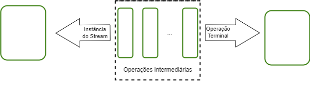

# Java 8: Conheça As Novidade Dessa Versão <!-- omit in toc -->

Agora o role está ficando interessante, estava meio desanimado com o tanto de teoria que estava vendo até agora. É muito massa trabalhar com as ***Lambdas Functions*** e com os ***Method Reference***, essas "tecnicas" deixam o código muito mais elegante.

Meu objetivo é chegar ao "estado da arte" na escrita de códigos, esse curso está sendo um passo muito importente rumo a esse objetivo.

Ao mesmo tempo que faço esse curso, estou estudando ***Git Flow***, topo de mais. Preciso disso para desenvolver sozinho, obvio que não, só não nego aprender coisas novas.

>Olhar para o topo mais alto e nunca desistir de escalar a montanha.

Que Deus me ajuda a superar todas as dificuldades; que meu maior objetivo seja a busca da verdade.

## Links Importantes <!-- omit in toc -->

* [ORACLE - Documentação Stream](https://docs.oracle.com/javase/8/docs/api/java/util/stream/Stream.html)
* [TUTORIALSPOINT - Java 8 - Default Methods](https://www.tutorialspoint.com/java8/java8_default_methods.htm)
* [GEEKSFORGEEKS - Default Methods In Java 8](https://www.geeksforgeeks.org/default-methods-java/)
* [GEEKSFORGEEKS - Lambda Expressions in java 8](https://www.geeksforgeeks.org/lambda-expressions-java-8/)
* [STACKOVERFLOW - Sobre Méthod Reference](https://pt.stackoverflow.com/questions/116069/qual-%C3%A9-a-finalidade-do-simbolo-no-java)
* [ALURA - Java 8: Lambda Ou Method Reference? Entenda A Diferença](https://www.alura.com.br/artigos/java-8-lambda-ou-method-reference-entenda-a-diferenca)
* [ORACLE - Processing Data With Java SE 8 Streams, Part 1](https://www.oracle.com/technical-resources/articles/java/ma14-java-se-8-streams.html)
* [GEEKSFORGEEKS - Java 8 Stream tutorial](https://www.geeksforgeeks.org/java-8-stream-tutorial/)

## Menu <!-- omit in toc -->

* [Aulas](#aulas)
  * [Default Methods](#default-methods)
  * [Que Venham Os Lambdas](#que-venham-os-lambdas)
  * [Código Mais Sucinto Com Method References](#código-mais-sucinto-com-method-references)
  * [Streams: trabalhando Melhor Com Coleções](#streams-trabalhando-melhor-com-coleções)
    * [Características](#características)
    * [Um pouco sobre o funcionamento](#um-pouco-sobre-o-funcionamento)
    * [Um pouco de operações](#um-pouco-de-operações)
    * [Um pouco de mundo real](#um-pouco-de-mundo-real)
  * [Mais Streams, Collectors e APIs](#mais-streams-collectors-e-apis)
  * [A Nova API De Datas](#a-nova-api-de-datas)

## Aulas

### Default Methods

O **Java 8** trouxe muitas coisas novas. Vamos conversar um pouco sobre os **Defauts Methods** e os **Static Default Methods**. Eles podem ser utilizados em interfaces dando a possibilidade delas terem novos métodos sem *quebrar* as classes que as implementam.

>Isso é tão mágico abriu caminho para os **lambdas** e **methods refereces**.

Chega de lorota, vamos ver como isso funciona, no fundo não tem nada de mais: eles são métodos implementados em interfaces que possuem um corpo.

```java
public interface vehicle {

   default void print() {
      System.out.println("I am a vehicle!");
   }

   static void blowHorn() {
      System.out.println("Blowing horn!!!");
   }
}
```

### Que Venham Os Lambdas

Agora começamos a nós torbar *magos dos códigos* cujo poder principal e desenvolver códigos limpos e expressivos, tudo isso é graças às **Lambdas**. Elas representam instâcias de uma **interfaces funcionais**, essas são aquelas que possuem um unico método abstrato. A sintaxe dela é basicamente:

>Parametros -> Corpo

Algumas caracteristicas:

* A declaração do tipo de parâmetro é opcional.
* Os **parênteses** nos parâmetros são opcionais quando só utilizamos um parâmetro e obrigatório nos demais casos.
* As **chaves** são opcionais quando o corpo tiver somente uma chamada, obrigatório nos demais casos.
* A palavra chave **return** é opcional.

### Código Mais Sucinto Com Method References

Se com as Lambdas somos o *Mister M* com os **Methods References** somos o *Mago Nego*. Devo concordar que é um tanto quanto difícil intender o que está acontecendo quando as olhamos pela primeira vez; confesso que ainda devem existir lacuas no meu conhecimento sobre esse tema.

Fato é: o código fica realmente elegante quando utilizamos methods reference.

```java
palavras.sort(Comparator.comparing(String::length));

curso.sort(Comparator.comparing(Curso::getAlunos));
```

Os methods references podem ser vistos em `String::length` e `Curso::getAlunos`, essa é a sintaxe.

Claro que eles não possuem tanto poder quanto as Lambdas, porém é sempre bom utiliza-los quando estamos trabalhando com métodos que não precisam receber parâmetros; eles possibilitam a redução na escrita dos Lambdas e para isso necessitam que o método da direita receva os mesmos parâmetros do da esquerda.

### Streams: trabalhando Melhor Com Coleções

Agora é a hora de juntarmos um tanto do que vimos até agora, *Mago Do Caos*?

Eis que no Java 8 surge a API Stream, a usamos para processar coleções de objetos; o massa é que elas geram um fluxo onde podemos encadear vários métodos. Como sempre ela é uma interface que da acesso ao método `stream()`.

>Se precisar de um processamento sofisticado, vai de stream.

```java
Stream magoCaos = magoNego.stream();
```

Os componentes básicos envolvidos em streams são:

* Sequência de Elementos: Os elementos são calculados sobre demanda e são um conjunto sequêncial de valores.
* Fonte: Coleção, matrizes ou I/O.
* Operações de agregação: Operações semelhantes a SQL, comuns em linguagens funcionais.
* Pipelining: Uma uma operação pode retornar um fluxo, elas podem ser encadeadas.
* Iteração interna: a iteração acotece nos bastidores.

#### Características

O stream não é uma estrutura de dados, ele recebe como entrata Collections, Arrays e I/O. Um ponto importante é que eles não alteram a estrutura de dados original, só retorna um resultado de acordo os métodos utilizados. Cada operação executada retorna um stream como resultado, e as operações de terminal marcam o fim do stream.

A imagem abaixo nós da uma ideia desse pipeline.



#### Um pouco sobre o funcionamento

```java
 List<Integer> ls
            = al.stream()
               .filter(i -> i % 2 == 0)
               .collect(Collectors::toList);
```

Dado uma lista de **Integer**, *al*, quereremos filtar todos os números pares e salvar em uma nova listas.

Primeiro transformaremos nossa lista em um stream, depois passaremos nossa condição para o `filter()`, veja que estamos usando uma lambda. Depois pegaremos o resultado dessa operação com o método `collect()` e utilizando o método `toList()` da classe **Collectors** gravaremos o retorno na lista *ls*.

#### Um pouco de operações

Por obvio existe uma grande gama de operações que podemos utilizar e encadear uma na outra, porém, sempre existe àquelas que mais usamos.

|Intermediarias|Término|Curto-Circuito|
|:---:         |:---:  |:---:        |
|filter()<br>map()<br>sorted()|forEach()<br>collect()<br>match()<br>count()<br>reduce()|anyMatch()<br>findFirst()|

As operações intermediárias retornam um stream, logo, podemos desencadear um certo tanto delas. As de terminal retornam uma instância de um determinado tipo, produzindo o resultado do pipeline. As de curto circuito são operações que não recebem um parâmetro, retornam algo especifico, claro que isso irá depender da operação.

```java
List<Integer> updatedMarks
            = marks.stream()
                  .map(i -> i + 6)
                  .collect(Collectors.toList());
```

Aqui temos novamente uma lista de inteiros mapearemos cada elemento adicionando mais 6 ao seu valor.

#### Um pouco de mundo real

Bem, normalmente queremos filtar nossa lista, **Predicate:** `filter()`, ordena-la, **Comparator:** `sorted()`, mapear para pegar algum valor, **Function:** `map()`, e retornar em uma nova lista, `collect()`. Isso deve resumir a maioria dos casos.

Podemos comprar esse fluxo com uma consulta **SQL**, é meio que a mesma coisa.

>Coleções são sobre dados, fluxos sobre cálculos

### Mais Streams, Collectors e APIs

Fiz uma boa descrição sobre Streams no capítulo a cima, e o [artigo](https://www.oracle.com/technical-resources/articles/java/ma14-java-se-8-streams.html) está muito completo.

### A Nova API De Datas

Agora não será necessário sofrer tanto com as datas, vemos o advento da `LocalDate`, basicamente ela resolve nossos maiores problemas com datas, como cálculo de intervalos, formatações, e tudo o que é rotina com esse tipo de objeto.

Não tem muito o que falar aqui: `LocalDate. + CTRL + SPACE`, isso responde muitas perguntas.

Tá, já que podemos querer mais.

* Para criar uma data atual: `LocalDate.now()`
* Para criar uma data passando valores: `LocalDate.of(2022, Month.SEPTEMBER, 20)`
* Para cálcular a diferença de datas: `olimpiadasDate.getDayOfYear() - hoje.getDayOfYear()` ou `Period.between(hoje, olimpiadasDate)`
* Para somar: `olimpiadasDate.plusYears(4)`
* Para formatar: `agora.format(DateTimeFormatter.ofPattern("dd/MM/yyyy hh:mm"))`

FIMMM!!!
