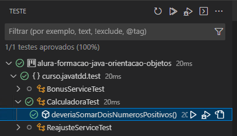
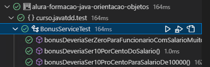

# TDD E Java: Teste Automatizados Com JUnit <!-- omit in toc -->

Por algum motivo os desenvolvedores não gostam de escrever código, bem eu penso que o motivo é o mesmo de todas as outras profissões, geralmente o pessoal não leva o trabalho a sério. Eu, ao menos até agora, achei fantástico o que as possibilidades da utilizaçã de testes. Até agora não utilizava em meus projeto, predendo começar.

Garantir que o que escrevemos está de acordo com a regra de negócio e que alterações não estragaram o que já estava certo já é um grande motivador para escrever bons testes.

A cada passo que dou para dentro desse oceano eu me apaixono mais pelo mundo de desenovolvimento. Que Deus não me deixe afogar e que a Verdade seja a minha búlsola.

## Links Importantes <!-- omit in toc -->

## Menu <!-- omit in toc -->

* [Aulas](#aulas)
  * [Motivação Dos Teste Automatizados](#motivação-dos-teste-automatizados)
  * [Escrevendo Um Teste Automatizado](#escrevendo-um-teste-automatizado)
  * [JUnit](#junit)
  * [Escrevendo Um Teste Com O JUnit](#escrevendo-um-teste-com-o-junit)
  * [Testando Uma Funcionalidade](#testando-uma-funcionalidade)
  * [Conhecendo TDD](#conhecendo-tdd)
  * [Implementando Uma Funcionalidade Com TDD](#implementando-uma-funcionalidade-com-tdd)
  * [Refactoring](#refactoring)
  * [Quando usar TDD](#quando-usar-tdd)
  * [Lidando com exceptions](#lidando-com-exceptions)
  * [Organizando O Código De Teste](#organizando-o-código-de-teste)
  * [Como Testar Métodos Privados](#como-testar-métodos-privados)
  * [O Que Testar Na Aplicação](#o-que-testar-na-aplicação)

## Aulas

### Motivação Dos Teste Automatizados

Realmente testar é uma tarefa maçante, ficar passando parâmentros para métodos e verificando a saída não é legal. Ainda bem que alguém resolveu pensar em como automatizar essa tarefa. Essa automação possibilitou uma cobertura maior de teste no código, menor tempo de teste e menor indice de erro humano.

Além de tudo isso, eles estimulam a evolução do código; podemos refatorar sem medo de errar. Veja que maravilha: refatoramos e rotamos o teste, dando tudo certo, é só publicar; dando errado voltamos à versão anterior e pronto, nada de errado.

### Escrevendo Um Teste Automatizado

Acabamos de nascer para os testes; iremos começar com algo bem simples: dado um classe calculadora que sabe somente como somar, criaremos alguns testes para ela.

Afim de tentar resolver esse problema, criamos a classe `CalculadoraTestes`, nela instanciaremos a `Calculadora` e realizaremos algumas operações:

```java
 Calculadora calculadora = new Calculadora();
int soma = calculadora.somar(3, 7);
System.out.println(soma);

soma = calculadora.somar(3, 0);
System.out.println(soma);

soma = calculadora.somar(0, 0);
System.out.println(soma);

soma = calculadora.somar(3, -7);
System.out.println(soma);
```

´´´console
10
3
0
-4
´´´

Até aqui é fácil verificar que o resultado saiu como o esperado.

Vamos imaginar que nossa calculadora começe a ganhar algumas funções a mais, e que os cenários de testes começem a ficar mais complexos. É fácil de notar que o modelo de teste utilizado não irá funcionar; essa foi a motivação da criação de uma biblioteca que de suporte aos nossos testes.

### JUnit

Direto-Reto: Essa é a biblioteca padrão para testes automatizados em Java, meio que ela reina sozinha no role. Seu foco é o teste de unidade.

### Escrevendo Um Teste Com O JUnit

No começo é tudo muito simples: Para usar JUnit no VS Code precisamos ter uma versã do Java maior do que 11 e os pluguins *Test Runner for java* e *JUnit JAR Downloader*, o segundo facilitará o download dos JARs.

Tendo tudo configurado, basta criar uma classe para teste com o mesmo nome da classe a ser testada mais o sulfixo ***Test***. Cada método dessa classe representará um teste a ser feito, e é ideal que ele tenha um nome bem descritivo. Outro fator importante é anotar o método com `@Test`.

```java
import org.junit.Assert;
import org.junit.Test;

public class CalculadoraTest {

  @Test
  public void deveriaSomarDoisNumerosPositivos(){
      Calculadora c = new Calculadora();
      int s = c.somar(3, 7);

      Assert.assertEquals(10, s);
  }
}
```

Se tudo estiver configurado como deve, o VS Code terá um menu lateral de teste, abrindo ele conseguiremos ver todos os testes escritos e o resultado de sua última execução



### Testando Uma Funcionalidade

Quanto mais eu me aprofundo em programação, mais eu me apaixono pelo que vejo. Muito bom ver as possibilidades que encontramos quando trabalhamos com testes automatizados. Cada vez mais estamos nós tornando magos da programação; um dia seremos o "Doutro Estranho"?

Agora estamos colocando a perna na água, já da para sentir o friozinho. Iremos realizar um teste um pouco mais real. Por questão de organização criei a pasta **test**, é dentro dela que estarão meus testes. Nosso objetivo é testar a seguinte classe:

```java
public class BonusService {

public BigDecimal calcularBonus(Funcionario funcionario) {
  BigDecimal valor = funcionario.getSalario().multiply(new BigDecimal("0.1"));
  if (valor.compareTo(new BigDecimal("1000")) > 0) {
    valor = BigDecimal.ZERO;
  }
  return valor.setScale(2, RoundingMode.HALF_UP);
}

}
```

Em casos que temos uma condição que testa um valor numerico é sempre bom realizar 3 testes: Um menor do que o valor testado, uma maior e outro igual. E lembre-se:

>Os nomes dos métodos devem ser o mais descritivos possível.

```java
public class BonusServiceTest {
    
    @Test
    public void bonusDeveriaSerZeroParaFuncionarioComSalarioMuitoAlto(){
        BonusService bs = new BonusService();
        BigDecimal b = bs.calcularBonus(new Funcionario("Rodrigo", LocalDate.now(), new BigDecimal("25000")));

        assertEquals(new BigDecimal("0.00"), b);
    }

    @Test
    public void bonusDeveriaSer10PorCentoDoSalario(){
        BonusService bs = new BonusService();
        BigDecimal b = bs.calcularBonus(new Funcionario("Rodrigo", LocalDate.now(), new BigDecimal("2500")));

        assertEquals(new BigDecimal("250.00"), b);
    }

    @Test
    public void bonusDeveriaSer10ProCentoParaSalarioDe10000(){
        BonusService bs = new BonusService();
        BigDecimal b = bs.calcularBonus(new Funcionario("Rodrigo", LocalDate.now(), new BigDecimal("10000")));

        assertEquals(new BigDecimal("1000.00"), b);
    }
}
```

Todos os sinais verdes, vida que segue.



### Conhecendo TDD

>Primeiro **Teste**; depois **Implementação**; com sorte **Refatora**.

Parece estranho, sim, mas funciona. Escrever primeiro o teste nos ajuda a garantir que nosso código vai fazer exatamente, e somente, aquilo que é necessário. Além disso os testes incentivam a refatoração; se fizermos alguma cagada o teste falha na hora, é só arrumar para que ele passe.

O problema aqui está na mentalidade do programador, normalmente não queremos ficar escrevendo teste, nem pensar nisso, queremos mesmo é código funcionando e rodando, queremos dar vida ao que está na cabeça das outras pessoas.

>Acalme-te, escreva bons testes, isso será de grande ajuda, cedo ou tarde.

O conceito é simples, e com prática e tempo iremos escrever testes cada vez melhores.

### Implementando Uma Funcionalidade Com TDD

Regra da nova funcionalidade:

1. Se o desempenho foi "A desejar", reajuste será de 3% do salário;
2. Se o desempenho foi "Bom", reajuste será de 15% do salário;
3. Se o desempenho foi "Ótimo", reajuste será de 20% do salário;

Primeira coisa a se pensar é: Qual o nome classe que implementará esse método? Não iremos criar a classe e sim a classe de teste, sendo assim criaremos a `ReajusteServiceTest`:

```java
public class ReajusteServiceTest {
    
  @Test
  public void reajusteDeveriaSerDeTresProcentoQuandoDesempenhoForADesejar(){
    //até aqui ReajusteService não existe
      ReajusteService rs = new ReajusteService();      
  }
}
```

Logo teremos uma classe `ReajusteService`, ao esrever essa parte, nosso teste não irá funcionar, deixe estar. Essa nossa clase ter uma método que cálcule o reajutes, `concederReajuste` me parece um bom nome, esse método precisa receber um funcionário, claro, e o desempenho dele, iremos querer que as possibilidades de desempenho estejam no enun `Desempenho`.

```java
public class ReajusteServiceTest {
    
  @Test
  public void reajusteDeveriaSerDeTresProcentoQuandoDesempenhoForADesejar(){
      ReajusteService rs = new ReajusteService();
      Funcionario f = new Funcionario("Rodrigo", LocalDate.now(), new BigDecimal("1000.00"));

      //até aqui o método concederReajuste não existe, nem Desempenho.A_DESEJAR
      rs.concederReajuste(f, Desempenho.A_DESEJAR);
     
      assertEquals(new BigDecimal("1030.00"), f.getSalario());
  }
}
```

Veja, até aqui não implementamos nada, a classe de teste nem compila. O interessante é que já pensamos no designe de nossa classe, já temos o nome do método, a parte mais difícil, diga-se de passagem, o que ele deve receber e o que ele deve fazer.

"Ctrl + ." irá ser uma mão na roda agora. Primeiro criamos a classe `ReajusteService`, depois o método `concederReajuste`, depois o enun `Desempenho` por fim colocamos a contante **A_DESEJAR** no enun.

Ufa, muito código gerado *automagicamente*, tudo compila, masss, o teste falha. Claro, falta a impementação do método `concederReajuste`. Sabemos que quando o desempenho for **A_DESEJAR** é preciso aumentar o salário em 3%, começaremos por ai. Tendo o valor do reajuste precisamos soma-lo ao salário atual, quereremos que o classe `Funcionario` realize essa operação, para isso ela precisa ter o método `reajustarSalario`, mais "Ctrl + .".

```java
public void concederReajuste(Funcionario funcionario, Desempenho desempenho) {
    if(desempenho == Desempenho.A_DESEJAR){
        BigDecimal reajuste = funcionario.getSalario()
                                         .multiply(new BigDecimal("0.03"));
        //até aqui não existe reajustarSalario, o criaremos.
        funcionario.reajustarSalario(reajuste);
    }
  }

public void reajustarSalario(BigDecimal reajuste) {
  this.salario = this.salario.add(reajuste)
                             .setScale(2, RoundingMode.HALF_UP);
}
```

Ao final do dia: Teste OK; podemos ir embora feliz.

### Refactoring

Agora a ultima perna so ciclo. Os testes irão garantir que nossa alteração não "quebre" o código. Não ficou nada elegante a forma como cálculamos um monte de reajuste, por isso vamos fazer algumas alterações.

A primeira será fazer com que o próprio enun retorne o percentual de reajuste, só isso já elimina o monte de ifs que foram utilizados.

```java
public enum Desempenho {
    A_DESEJAR {
        @Override
        public BigDecimal percentualReajuste() {            
            return new BigDecimal("0.03");
        }
    }, 
    BOM {
        @Override
        public BigDecimal percentualReajuste() {
            return new BigDecimal("0.15");
        }
    }, 
    OTIMO {
        @Override
        public BigDecimal percentualReajuste() {
            return new BigDecimal("0.20");
        }
    };

    public abstract BigDecimal percentualReajuste();

}
```

Agora fica fácil arrumar a classe ReajustesService, no lugar de um monte de if usamos o enun.

```java
public void concederReajuste(Funcionario funcionario, Desempenho desempenho) {        
        BigDecimal percentual = desempenho.percentualReajuste();
        BigDecimal reajuste = funcionario.getSalario().multiply(percentual);
        funcionario.reajustarSalario(reajuste);
    }
```

Testes ainda passando, refatoração realizada com sucesso.

### Quando usar TDD

Escrever teste antes ou depois do código? Eis a questão?

Agora entramos no império da **Preguiça**, quem quer ter mais trabalho? Logo, para que escrever antes? O problema de escrever depois é o vies que teremos, já escreveremos pensando na lógica de implementação. Sem contar que estaremos cansados de pensar no problema, e tudo o que quereremos é nos livrar dele e ficar de boas.

Escrevendo antes só pensaremos no designe do código e no resultado esperado, e por não estarmos cansados de pensar sobre o assunto, escreveremos bons testes, ou deveríamos. E ao finalizar a solução do problema já teremos os senários de testes prontos, é só rodar e ser feliz.

Bem, vejo que antes é melhor, pois enquanto escrevemos o código de teste já pensamos no comportamente esperado de nossa classe ou método, quando formos implementa-lo já teremos meio caminho andado.

### Lidando com exceptions

O Junit nós permite testar uma exceção de duas formas:

Em uma podemos usar o método `assertThrows()` passando como parâmetro a classe de erro esperado, e a chamada do método, é importante notar que `assertTrows` espera uma Lambda nesse caso.

```java
assertThrows(
  IllegalArgumentException.class,
  () -> bs.calcularBonus(new Funcionario("Rodrigo", LocalDate.now(), new BigDecimal("25000")))
);
```

Em um outro modelo, podemos usar o `try catch`, se a chamada do método não retornar um erro, usamos o método `fail()`, isso força o JUnit a falhar o teste; se não passar podemos deixar o catch sem implementação. Ouuuu, esse abordagem permite testar a mensagem de retorno. Lindo.

```java
try {
    bs.calcularBonus(new Funcionario("Rodrigo", LocalDate.now(), new BigDecimal("25000")));
    fail("Não deu bom");
} catch (Exception e) {
    assertEquals("Funcionário com salário maior do que R$10.000,00 não pode receber bônus", e.getMessage());
}
```

### Organizando O Código De Teste

Já que refatoramos a implementação do requisito, vamos refatorar também o teste. Em nossa primeira implementação instânciamos várias veses a classe **ReajusteService** e **Funcionários**, vamos começar por ai, criar atributos em nossa classe. Além disso podemos utilizar a tag `@BeforeEach`, ela faz com que a classe `iniciarlizar()` seja executada antes de cada teste.

```java
 private ReajusteService reajusteService;
  private Funcionario funcionario;

  @BeforeEach
  public void inicializar(){
      this.reajusteService = new ReajusteService();
      this.funcionario = new Funcionario("Rodrigo", LocalDate.now(), new BigDecimal("1000.00"));
  }
```

Já melhorou um tanto, e para fins didáticos vamos ver algumas outras anotações:

* `@AfterEach` é executado após cada teste;
* `@BeforeAll` é executado antes de todo mundo;
* `@AfterAll` é executado depois de todo mundo.

```java
@AfterEach
public void finalizar(){
  System.out.println("Fim");
}

@BeforeAll
public static void antesDeTodos(){
  System.out.println("Aconteço antes de todos");
}

@AfterAll
public static void depoisDeTodos(){
  System.out.println("Aconteço depois de todos");
}
```

### Como Testar Métodos Privados

Resposta curta: Não precisamos.

Explico: Testamos os efeitos dos métodos privados, se eles são privados quer dizer que a própria classe os utiliza para modificar algo.

Por exemplo: temos o método privado `arredondarSalario` que é utilizado no método `reajustarSalario`, dessa forma, ao testar o reajustaSalario já estamos testando o arredondarSalario.

```java
public void reajustarSalario(BigDecimal reajuste) {
  this.salario = this.salario.add(reajuste);
  arredondarSalario();
}

private void arredondarSalario() {
  this.salario = this.salario.setScale(2, RoundingMode.HALF_UP);
}
```

### O Que Testar Na Aplicação

>Claro que tudo não, só o que interessa.

O mais importante a se testar são as regras de négocio, cálculos, validações, enfim, todo código que sobre alteração constante e possui relevância para o négocio.

>Qual o valor de testar geters e seters que não possuem lógica alguma?

Esse é o fim de uma breve introdução.

>Que Deus ilumine minha inteligência para que eu seja capas de ser persistente nessa caminhada e tenha cada vez mais vontade de adentrar nesse universo de programação.
